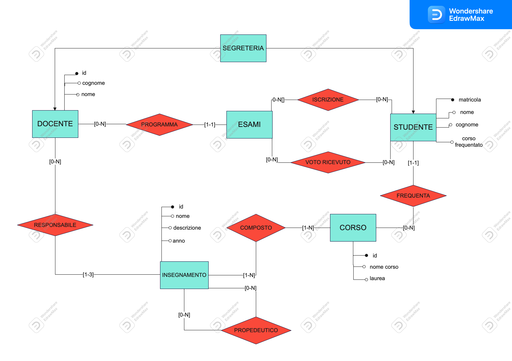

##Progetto per la creazione di un sito per la gestione delle funzionalità web basiche per l'ateneo

###scelte progettuali per il database
per la creazione del database si è scelto di seguire il seguente schema ER

###scelte progettuali per le pagine web
####-> pagina di login
è una semplica pagina di login che permette il riempimento di una form con i dati dell'utente quali username(email) e password.
per velocizzare ulteriormente la efficienza del database si è deciso di implementare un selettore che permetterà di selezionare la tabella del database dalla quale esaminare i dati per fare il login (studente, docente, segreteria).

####-> pagina principale utente
le pagine di ogni tipologia di utente saranno differenti poichè implementeranno funzionalità diverse:
pagina studente:
la pagina studente permetterà di consultare i dati riguardanti l'esito degli esami e di potersi iscrivere ad un esame nuovo
(a patto che sia presente nel proprio corso di studi)

pagina docente:
la pagina docente permetterà di poter inserire dei voti per ogni singolo studente inoltre permette, tramite la compilazione di un form, di inserire nuove date per gli esami