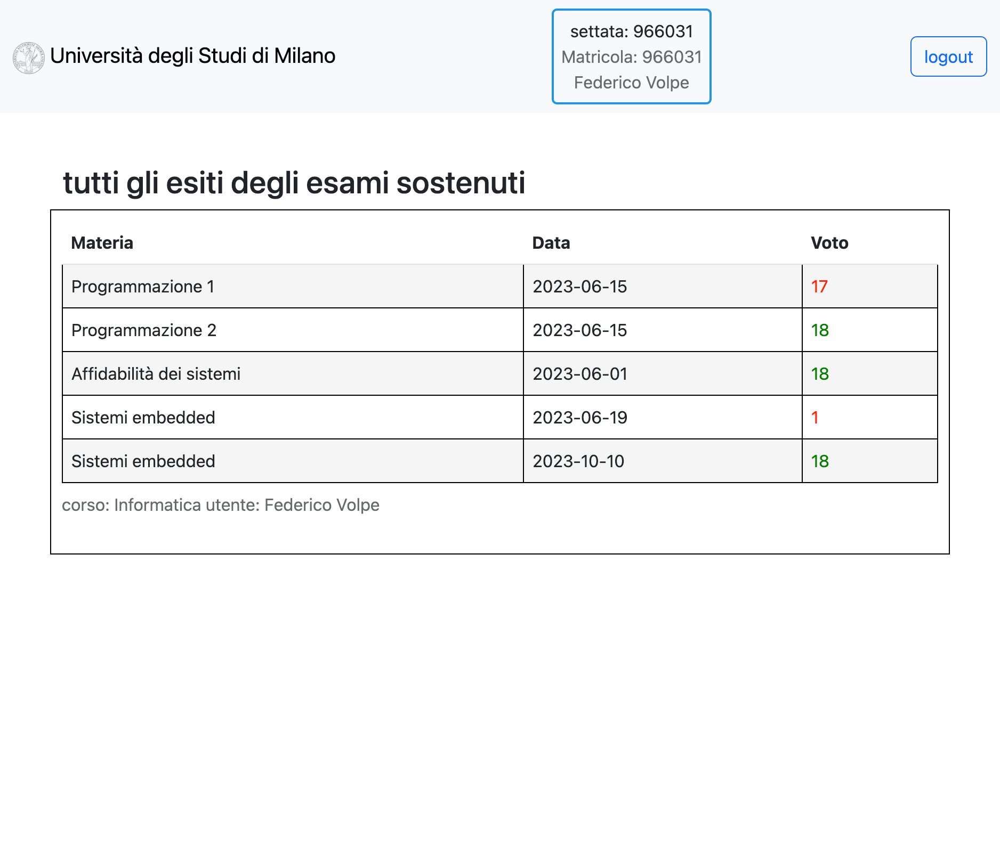
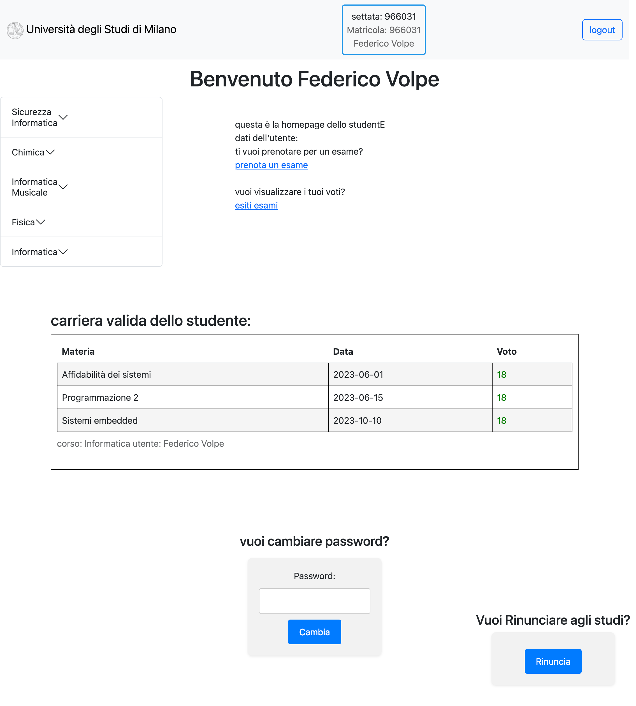

##Progetto per la creazione di un sito per la gestione delle funzionalità web basiche per l'ateneo

###scelte progettuali per il database
per la creazione del database si è scelto di seguire il seguente schema ER

    

<h3>scelte progettuali per le pagine web</h3>

    

        <h3>pagina di login</h3>
        
È una semplice pagina di login che permette il riempimento di una form con i dati dell'utente 
        quali email e password.

    

    

nella pagina di login è presente un flag che indica se è stato tentato un accesso, se cosi fosse viene chiamato lo script:

    
    

        

            <a href="dispatcher.php">dispatcher.php</a> - composta da solo codice PHP, si occuperà di reindirizzare l'utente alla propria pagina personale (studente, docente o segreteria), passando le variabili mail e password tramite l'apertura di una sessione.
            Il dispatching verrà eseguito tenendo conto del finale della email dell'utente.
        

    

#### -> pagina principale utente
le pagine di ogni tipologia di utente avranno alcuni aspetti comuni:
- La verifica dell'utente tramite una query di verifica
- Il recupero delle informazioni personali dell'utente contenute nel database
- Il reindirizzamento alla pagina di login qualora uno dei due step precedenti non dovesse andare a buon fine e la segnalazione tramite un codice errore apposito
- il codice php per un eventuale cambio password previsto per tutti gli utenti
- importazione di file come head, navbar, link agli script di bootstrap, display di messaggi di errore
  
  

    

        <h3>pagina studente:</h3>
        
La pagina studente permetterà di consultare i dati riguardanti l'esito degli esami (che essi riguardino la carriera completa oppure valida):

        <ul>
            <li><a href="carriera_valida.php">carriera_valida.php</a>: viene esposto il contenuto della carriera valida dello studente con cui è stato eseguito il login (viene mostrato direttamente nella pagina principale dello studente).</li>
            <li><a href="esiti_esami.php">esiti_esami.php</a>: in questa pagina accessibile tramite un link dalla homepage dello studente verranno mostrati in una tabella simile alla precedente tutti gli esiti ottenuti dallo studente.
                
            </li>
        </ul>
    

    

        
        
sulla destra della pagina verranno mostrate le informazioni riguardanti *tutti i corsi dell'università disponibili* (compreso l'elenco di tutti gli insegnamenti).

    

    

        
Vi è la possibilità inoltre di potersi iscrivere ad un esame nuovo tramite un link "prenota un esame" che porta alla pagina

        
<a href="prenota_esame.php">prenota_esame.php</a>: 
        questa pagina mostra allo studente una tabella con tutti gli esami che sono stati programmati dai professori del rispettivo corso a cui si è iscritti con qualche informazione aggiuntiva (come data o professore responsabile). I pulsanti per la iscrizione prenderanno una forma differente se lo studente risulta già iscritto all'esame o meno, tramite gli stessi sarà anche possibile annullare l'iscrizione ad un esame. La pagina è provvista di messaggi di errore qual'ora si verifichi un problema durante l'iscrizione o di qualsiasi altro genere
    

    

infine in fondo alla pagina verrà sempre mostrato un pulsatne per la rinuncia agli studi, quando questo verrà premuto lo studente corrente verrà cancellato dalla tabella degli studenti e spostato nella tabella storico_studente

    

        <h3>pagina docente:</h3>
        
La pagina docente mostra come prima cosa la tabella che rappresenterà il calendario degli esami del professore.
        Questa mostrerà l'insegnamento, la data, due pulsanti per la modifica (connesso allo script <a href="update_esame.php">update_esame.php</a>) o la cancellazione del suddetto esame (connesso allo script <a href="cancella_esame.php">cancella_esame.php</a>).

        
Successivamente verrà mostrato un form generato dalla pagina:

        <ul>
            <li><a href="form_inserisci_esame.php">form_inserisci_esame.php</a>: Ha il compito di raccogliere le informazioni per un nuovo esame, quali: insegnamento, data dell'esame.
            Il compito dell'inserimento nel database viene poi delegato al file <a href="inserzione_esame.php">inserzione_esame.php</a> che si occuperà fra l'altro di riportare eventuali messaggi di errore o di successo legati all'esecuzione della query alla pagina precedente (ad esempio la presenza di un esame con lo stesso id già inserito nel database).
            </li>
            <li>
                 
            </li>
        </ul>
        
Successivamente verrà mostrato un form per l'inserzione degli esiti, anche questo ha la sua pagina dedicata:

        <ul>
            <li><a href="form_inserzione_esiti.php">form_inserzione_esiti.php</a>: Questo si occupa della raccolta di dati quali: la matricola dello studente interessato, l'esame, l'esito da assegnare.
            L'esecuzione dell'operazione di inserimento, come nel caso precedente, viene delegata alla pagina <a href="sql_inserzione_esiti.php">sql_inserzione_esiti.php</a>.
            Quest'ultimo si occuperà di effettuare tutte le verifiche necessarie per l'inserzione (come la verifica dell'iscrizione dello studente a quell'esame o la correttezza dell'id studente).</li>
            

                <video src="../media/inserimento-voto.mov" controls></video>
            

        </ul>
    

    

<h2>pagina segreteria</h2>

La pagina segreteria.php conterrà diversi form per l'apportazione di modifiche sul database, in particolare saranno presenti 5 form:

<h4>----form per la gestione dei docenti----</h4>

Per la modifica/inserimento/cancellazione di un utente @docenti.unimi.it

Raccoglie le informazioni: id, email, nome, cognome, password, operazione. In particolare, il parametro "operazione" può assumere 3 diversi valori (inserisci, modifica, cancella) e servirà per differenziare il comportamento del file:

<ul>
    <li>
        <strong>update_docente.php:</strong> Come prima cosa viene eseguita una query che stabilisce l'esistenza o meno di uno studente con l'id interessato:
        <ul>
            <li>Con il parametro "inserisci" verranno richiesti tutti i parametri essenziali per l'esecuzione di una query di inserimento nella tabella docente.</li>
            <li>Con il parametro "modifica" verrà prima composta una query con dei check sulle variabili che possono interessare una modifica prima di essere eseguita.</li>
            <li>Con il parametro "cancella" viene eseguita una semplice query di delete sul database.</li>
        </ul>
        Alla fine di ogni operazione vengono comunque generati messaggi che indicano l'esito dell'esecuzione delle operazioni. Questi messaggi verranno mostrati nella pagina segreteria.php.
        

                <video src="../media/update_docente.mov" controls></video>
        

    </li>
</ul>

<h4>----form per la gestione degli studenti----</h4>

Per la modifica/inserimento/cancellazione di un utente @studenti.unimi.it

Raccoglie le informazioni: matricola, email, nome, cognome, password, operazione.

<ul>
    <li>
        <strong>update_studente.php:</strong> Come prima cosa viene eseguita una query che stabilisce l'esistenza o meno di uno studente con l'id interessato:
        <ul>
            <li>Con il parametro "inserisci" verranno richiesti tutti i parametri essenziali per l'esecuzione di una query di inserimento nella tabella studente.</li>
            <li>Con il parametro "modifica" verrà prima composta una query con dei check sulle variabili che possono interessare una modifica prima di essere eseguita.</li>
            <li>Con il parametro "cancella" viene eseguita una semplice query di delete sul database.</li>
        </ul>
        Alla fine di ogni operazione vengono comunque generati messaggi che indicano l'esito dell'esecuzione delle operazioni. Questi messaggi verranno mostrati nella pagina segreteria.php.
        

                <video src="../media/update_studente.mov" controls></video>
        

    </li>
</ul>

<h4>----form per la gestione dei corsi----</h4>

Per la modifica/inserimento/cancellazione di un corso

<ul>
    <li>
        <strong>update_insegnamento.php:</strong> Il funzionamento è analogo ai form precedenti
        

                <video src="../media/update_corso.mov" controls></video>
        

    </li>
</ul>

<h4>----form per la gestione degli insegnamenti----</h4>

Per la modifica/inserimento/cancellazione di un insegnamento

<ul>
    <li>
        <strong>update_insegnamento.php:</strong> Come prima cosa viene eseguita una query che stabilisce 

                <video src="../media/update_insegnamento.mov" controls></video>
        

    </li>
</ul>

<h4>----form per il controllo di una carriera di uno studente----</h4>

il form raccoglie le informazioni riguardanti lo studente per poi richiamare il file:

<ul>
    <li>
        <strong>update_insegnamento.php:</strong> Come prima cosa viene eseguita una query che stabilisce 

                <video src="../media/inserimento-voto.mov" controls></video>
        

    </li>
</ul>