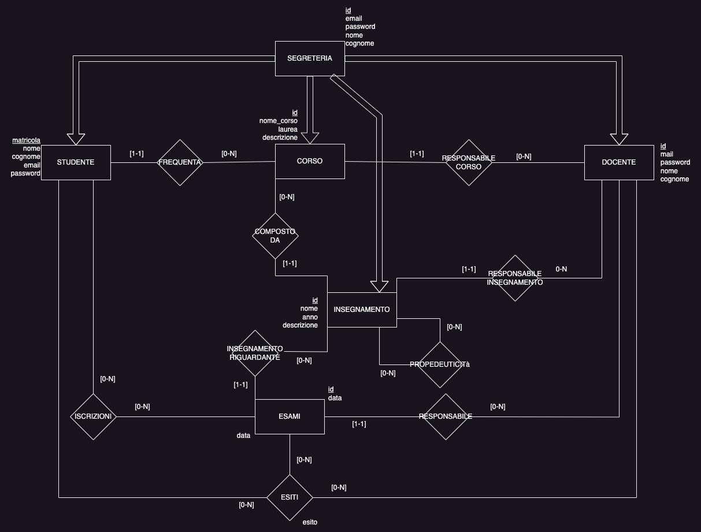
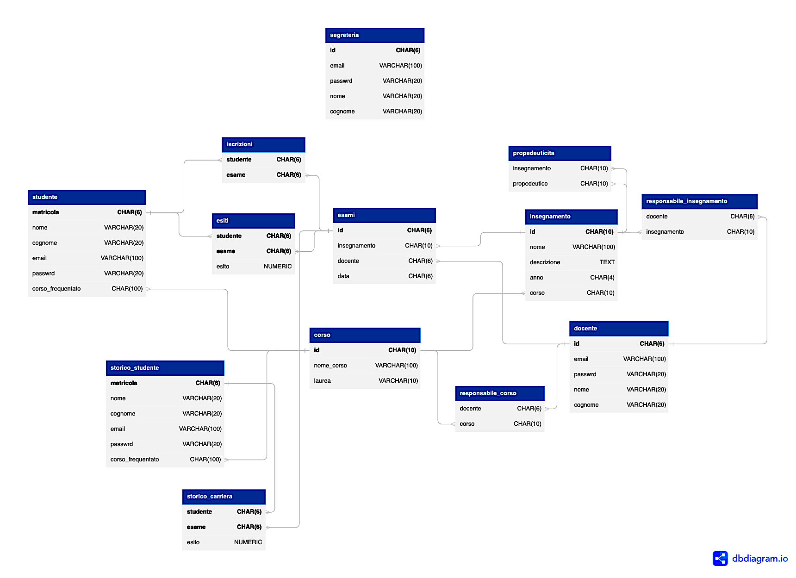
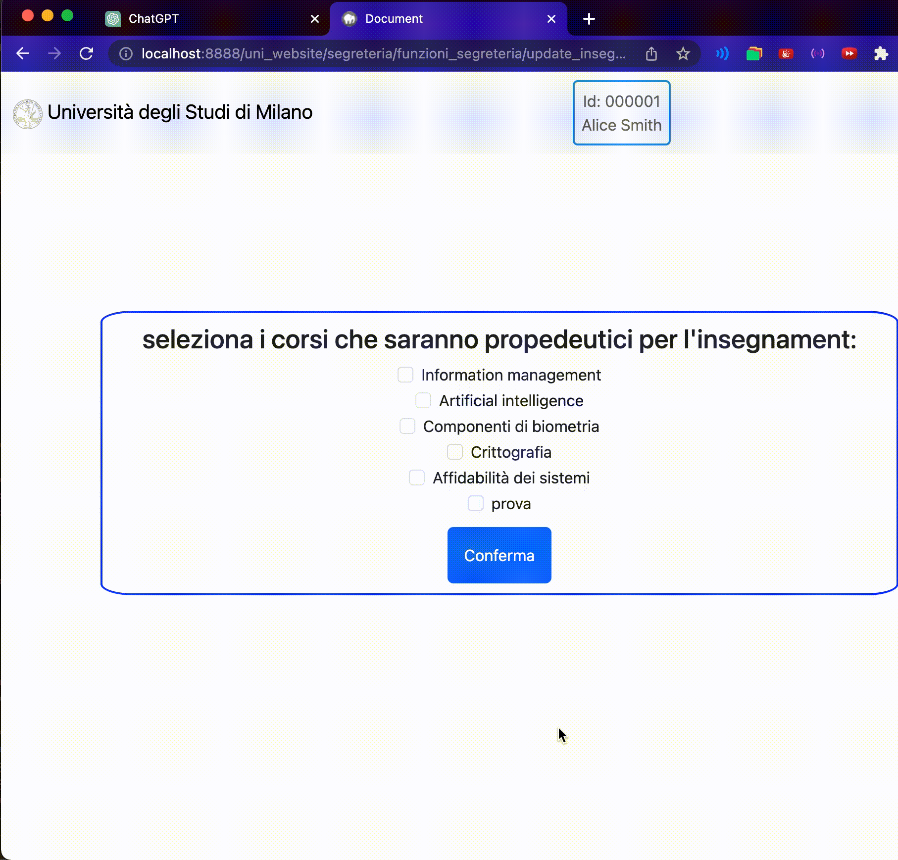
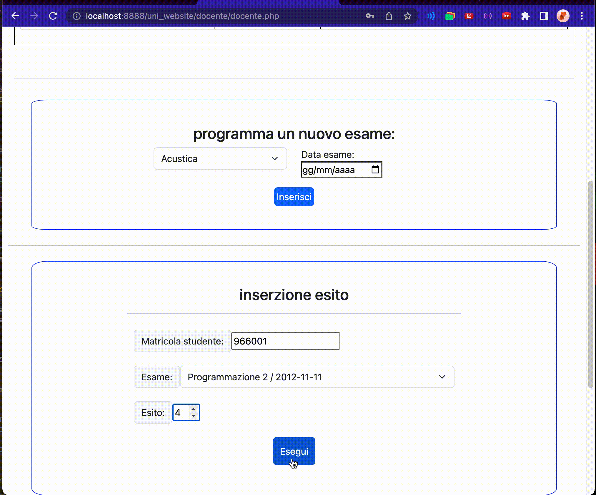
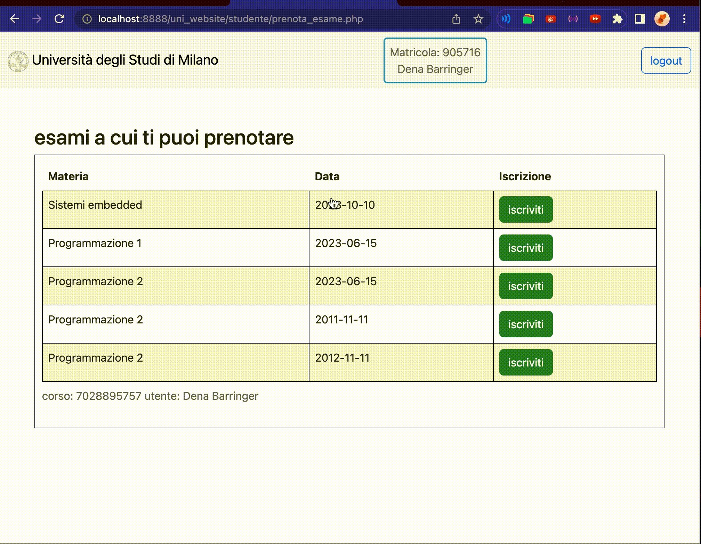

# Progetto Database Unimi

Ho deciso di implementare un unico schema chiamato "unimi_it" per il database denominato "unimio". Questo schema conterrà tutte le tabelle necessarie per il progetto.

Lo schema entità-relazione è stato strutturato come mostrato nell'immagine seguente:

    

Successivamente alla creazione dello schema ER, ho apportato alcune migliorie al fine di ridurre il numero di tabelle necessarie. In particolare, ho deciso di incorporare le relazioni [1-1] tra due entità nella stessa tabella, sotto forma di attributo che fa riferimento all'altra entità. Questo ha permesso di risparmiare una tabella per la relazione.

L'entità "segreteria", anche se non ha relazioni con le altre entità, ha la possibilità di definire nuovi utenti e nuovi corsi. Questa funzionalità è stata implementata utilizzando le frecce nello schema.

## Schema Logico

    

 
Il database è stato popolato con dati realistici al fine di consentire l'esplorazione delle varie funzionalità dell'applicazione web. ovvero: 
- 16 studenti iscritti a tutti i differenti corsi
 - 10 docenti di cui responsabili di corsi e di insegnamenti(massimo 3)
 - 5 utenti di segreteria
 - 5 corsi differenti, ciascuno composto da una media di 5 insegnamenti
 - tabella iscrizioni con 7 iscrizioni per le prove
 - 1 propedeuticità per il corso programmazione2
 - 1 studente con 1 voto nella sezione storico studente e storico_carriera derivante dalla prova
 
 

Di seguito vengono elencati i trigger che sono stati implementati:

- `insegnamenti_responsabile_trigger`: impedisce a un professore di diventare responsabile di più di tre insegnamenti.

- `verifica_iscrizione_trigger`: Prima di inserire un esito per un esame, viene verificato che lo studente sia effettivamente iscritto a quell'esame.

- `cancellazione_studente_trigger`: Prima di cancellare uno studente, i suoi dati vengono spostati nel database.

- `salvataggio_esiti_trigger`: per il salvataggio dei dati riguardanti un esito cancellato (dovuto alla cancellazione di uno studente). dimostrazione nel trigger precedente

- `before_insert_esami`: per la creazione di un codice ID unico prima dell'inserimento di un nuovo esame da parte di un professore.

- `controllo_propedeutici_trigger`: Prima dell'iscrizione di uno studente a un esame, viene controllato che siano stati superati tutti gli esami propedeutici.

- `esami_giornalieri`: prima dell'inserzione di un nuovo esame viene controllato che la data di questo non sia uguale a quella di un altro esame dello stesso corso
